# Attendance-Manager
&nbsp;&nbsp; &nbsp; &nbsp;&nbsp;&nbsp;&nbsp;&nbsp;&nbsp;A project that allows you to manage and track your attendance.

### Requirements:

Install the latest java version from https://www.java.com/en/

### Steps to run:
* Download the  source code.
  
* Setup the database using the DDL commands available in SQL.sql file in `com/attendance_manager/components/SQL.sql`

* Run the Main.java source file.

### Screenshots:
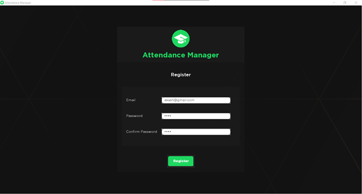
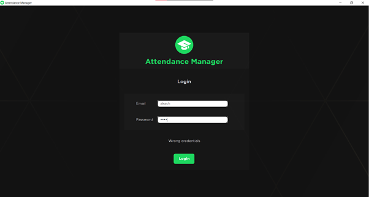
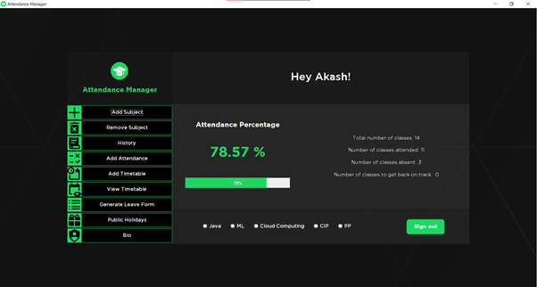
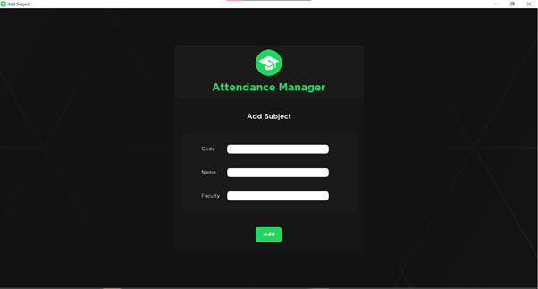
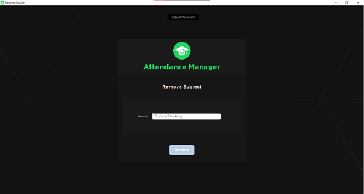
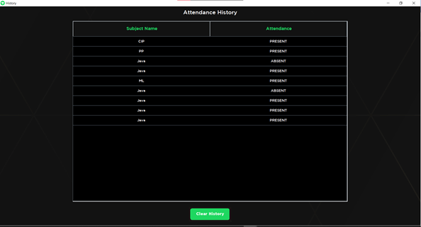
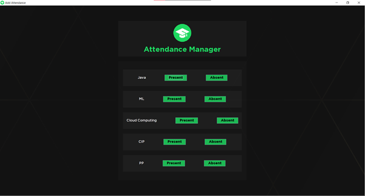
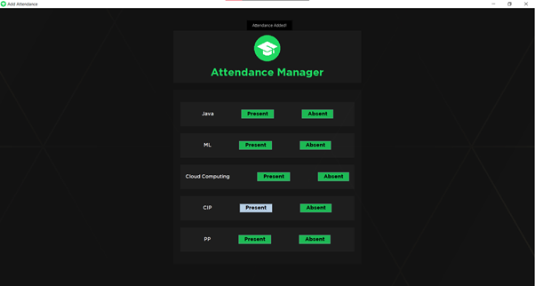
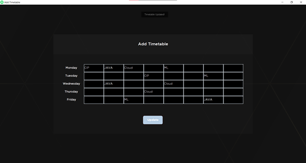
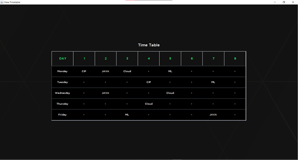
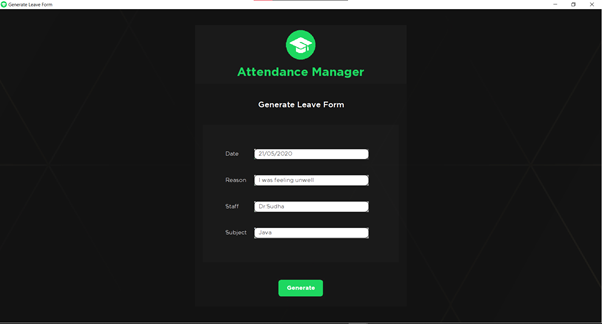
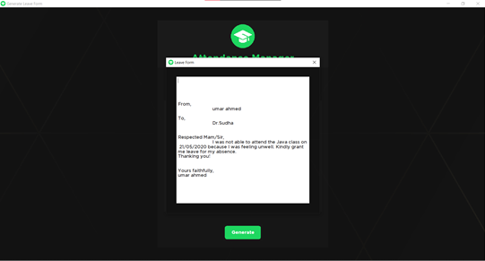
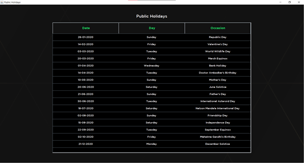
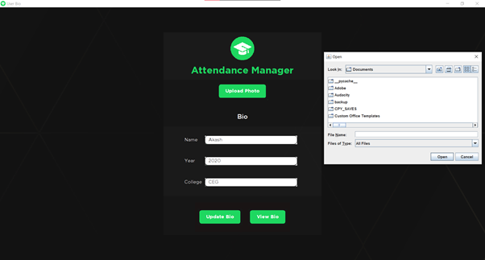

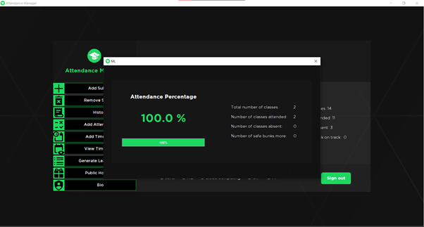
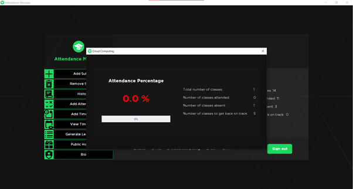

